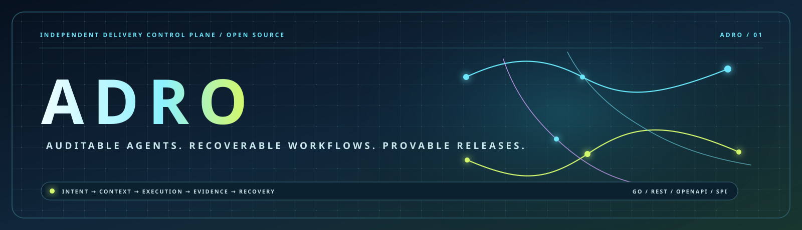
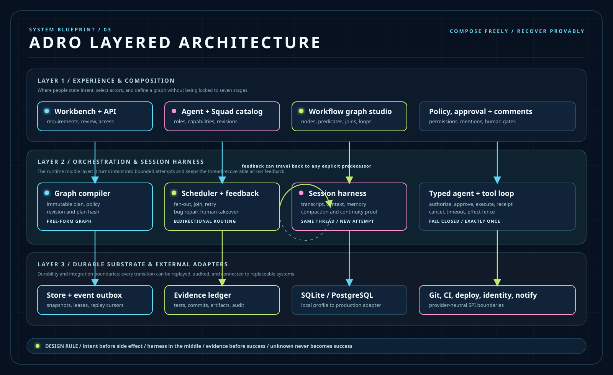

<p align="center">
  
</p>

<p align="center">
  <a href="README.zh-CN.md">中文入口</a> ·
  <a href="docs/product-requirements.en.md">Product requirements</a> ·
  <a href="docs/architecture/adro-technical-design.en.md">Technical design</a> ·
  <a href="ABOUT.md">About</a>
</p>

<p align="center">
  <a href="https://github.com/programming-pupil/adro/actions/workflows/ci.yml"></a>
  <a href="https://github.com/programming-pupil/adro/actions/workflows/contracts.yml"></a>
  <a href="https://github.com/programming-pupil/adro/actions/workflows/browser.yml"></a>
  <a href="https://github.com/programming-pupil/adro/actions/workflows/license.yml"></a>
  <a href="LICENSE"></a>
</p>

# ADRO

ADRO is an open-source control plane for auditable software delivery. It
connects goal intake, freely composed Agent/Squad workflows, durable context,
quality gates, repair, and release evidence in one recoverable graph. Agents can
move forward or send work back through explicit feedback edges; the session
harness keeps context, attempts, and evidence connected across that loop.

The local profile is a real Go service with an owned browser workbench. It
persists requirements, bugs, sessions, transcripts, checkpoints, memory,
leases, outbox records, artifacts, and audit facts. External Git, CI, deploy,
identity, and notification systems are replaceable SPI adapters rather than
hidden core dependencies.

## How ADRO fits together

The layered architecture separates the user-facing composition surface, the
orchestration and session-harness runtime, and the durable storage/integration
substrate. The harness belongs in the middle layer because it carries the
recoverable execution context between graph decisions and side effects.



The architecture view is complemented by a delivery-flow view and a capability
map. The flow is intentionally not the architecture: it shows how a run moves
from intent to proof, including the bidirectional repair loop.


## Quick start

Requirements: Go 1.24+, Git, curl, and an installed coding client. Docker is
not required for the local profile.

```bash
ADRO_EXECUTOR="$(command -v codex)" \
ADRO_ADMIN_PASSWORD='change-this-password' \
./start.sh --no-docker --no-open
```

Open `http://127.0.0.1:8081`. The API readiness endpoint is
`http://127.0.0.1:8080/readyz`.

```bash
./start.sh --status
./start.sh --stop
```

Set `ADRO_HOME`, `ADRO_API_PORT`, and `ADRO_WEB_PORT` to isolate state or run
multiple local profiles. `ADRO_EXECUTOR_COMMAND` accepts an argv-style command
with `{input}` as the stage prompt placeholder.

## Development

```bash
go test ./...
make verify
make real-e2e   # requires an authenticated real coding client
```

`make verify` runs unit and race tests, vet, build, API/HTML/OpenAPI contracts,
startup checks, the SPDX license/SBOM verifier, and the Playwright browser
suite. Browser tests use the checked-in no-op executor fixture so CI does not
depend on a developer workstation; `make real-e2e` is the model-backed path.

## Repository map

- `internal/`: domain, workflow, provider, harness, storage, API, and audit
  packages.
- `apps/web/`: the owned Chinese/English workbench.
- `docs/`: product, architecture, operations, compatibility, and release docs.
- `sdk/`: provider, harness, integration, and artifact extension contracts.
- `migrations/`: versioned persistence schema boundaries.

Core highlights: free-form graph composition, Agent/Squad routing, typed
session-harness continuity, explicit bidirectional feedback, bounded retries,
and evidence-backed completion.

Release and security policy are in `RELEASE.md` and `SECURITY.md`. The full
About-panel copy is in `ABOUT.md`; the Chinese project entry is
`README.zh-CN.md`.
