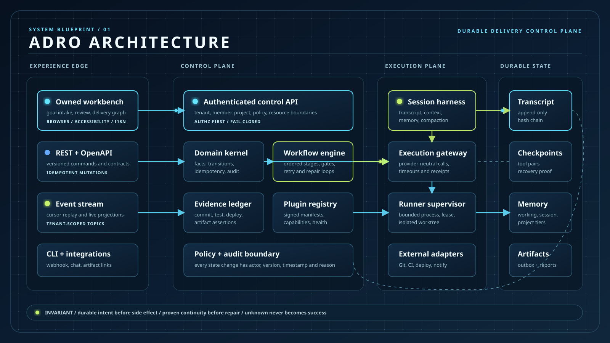

# ADRO

[](https://github.com/programming-pupil/adro/actions/workflows/ci.yml)

ADRO (Agentic Delivery & Release Orchestrator) is an independent control plane
for auditable, multi-repository delivery by coding agents. The repository does
not embed, download, patch, or call any other orchestration product. Its only
runtime dependency is an operator-selected local coding executable.

The product owns requirements, bugs, work items, evidence, provenance, tenant
boundaries, agent routing, pipeline state, durable session transcripts,
checkpoints, context archives, repair attempts, leases, and the browser
workbench. `internal/provider` exposes a small provider-neutral SPI.
`LocalProvider` is the shipped implementation: it discovers `claude`,
`codex`, or `claude-code`, invokes the real executable with `os/exec`, captures
output and git evidence, and keeps the original session/worktree for repairs.
The deterministic provider in tests is not selectable by the runtime profile.

## 中文简介 / Chinese overview

ADRO 是独立的 AI 研发交付控制面。它把需求、Bug 或分析目标编排为可审计、
可恢复的七阶段流程：方案、研发、单测、集成测试、仲裁、复测和报告。每个
阶段都绑定租户、项目、仓库、Agent、Session、证据和权限；失败会回到原始
开发上下文，不会静默创建一条失去历史的新链路。

ADRO is an independent AI delivery control plane. It turns a requirement, bug,
or analysis goal into a seven-stage, auditable and recoverable workflow. Each
stage carries tenant, project, repository, agent, session, evidence, and policy
state; failures return to the original development context instead of silently
starting an unrelated chain.




## Push checks / Push 检查

Every push and pull request runs the repository gate in
`.github/workflows/ci.yml`: formatting, vet, race tests, build, API/HTML
contracts, SBOM and license checks, startup checks, and the Chromium, Firefox,
and WebKit browser suites. A green badge means the deterministic gates passed;
the real-client acceptance path remains an explicit operator command (`make
real-e2e`) because it requires local credentials.

每次 push 和 Pull Request 都会执行 `.github/workflows/ci.yml` 中的代码检查：
格式、静态分析、竞态测试、构建、API/HTML 契约、SBOM 与许可证、启动检查，
以及 Chromium、Firefox、WebKit 浏览器测试。徽章为绿色表示自动门禁通过；
真实客户端验收需要本机凭证，因此通过 `make real-e2e` 显式执行。

## Quick start

Prerequisites: Go 1.24+, Git, curl, and one installed coding client. Docker is
not required or used by the local profile.

```bash
ADRO_ADMIN_PASSWORD='change-this-password' ./start.sh --no-open
```

`start.sh` builds the API and WebUI binaries, discovers the first available
executor (`ADRO_EXECUTOR` overrides discovery), creates state under `.adro`,
starts both local processes, and verifies `/readyz` plus the WebUI. Open
`http://127.0.0.1:8081` after startup.

Useful lifecycle commands:

```bash
./start.sh --status
./start.sh --stop
```

For a custom command, set `ADRO_EXECUTOR_COMMAND`. Arguments are split without
a shell and `{input}` is replaced with the stage prompt:

```bash
ADRO_EXECUTOR_COMMAND='claude -p {input} --permission-mode acceptEdits' ./start.sh
```

The API listens on `ADRO_API_PORT` (default `8080`) and the WebUI on
`ADRO_WEB_PORT` (default `8081`). `ADRO_PUBLIC_API_URL` is automatically set to
the local API URL for executor callbacks; override it when the executor runs in
another network namespace. `ADRO_HOME`, `ADRO_ARTIFACT_ROOT`,
`ADRO_WORK_ROOT`, `ADRO_RUN_STATE_FILE`, `ADRO_HARNESS_STATE_FILE`, and
`ADRO_PLUGIN_STATE_FILE` control execution checkouts, durable harness state,
and the signed plugin registry. Set
`ADRO_AUTH_MODE=required` with `ADRO_ADMIN_PASSWORD` for protected routes.
Set `ADRO_EXECUTOR_TIMEOUT=15m` (Go duration) to bound an individual client run;
an expired run is recorded as `timed_out` with its session/worktree evidence
intact and is treated as an auditable pipeline failure. `ADRO_PIPELINE_WATCH_TIMEOUT`
(default `30m`) bounds how long a local pipeline may wait for a terminal result;
when it expires ADRO cancels the provider run and suspends the pipeline with a
durable reason instead of leaving `waiting_provider` forever.

## From source

```bash
go test ./...
go run ./cmd/adro-api -addr :8080 -artifact-root ./var/artifacts
go run ./cmd/adro-web -addr :8081 -root ./apps/web
```

The API exposes readiness at `/readyz`, secret-free executor diagnostics at
`/api/v1/provider/diagnostics`, and versioned resources below `/api/v1`. The
session harness is available at `/api/v1/sessions/{id}/turns`,
`/checkpoints`, `/context/status`, `/context/compile`, `/compact`, and
`/recover`; `/memory/reduce` extracts cited fact/constraint/decision claims and
`/context/integrity` runs transcript hash and archive recall probes. A durable
profile keeps the complete turn chain in `harness.json.transcript.jsonl` using
fsynced append-only records; startup reconciles it with the fast snapshot and
fails closed on tampering or reordering.
Signed adapter installations are managed through `/api/v1/plugins` and are
never activated before manifest digest/signature verification.
seven-stage pipeline is design, development, unit test, integration test,
arbitration, revalidation, and report. A failed integration test returns to the
same development session and worktree; a missing or mismatched continuity
record is rejected rather than silently starting over.

Requirement and bug discussions are first-class, immutable threads:
`GET/POST /api/v1/requirements/{id}/comments` and
`GET/POST /api/v1/bugs/{id}/comments` support replies through `parent_id`,
cursor pagination, explicit mentions, and an optional follow-up dispatch to the
target agent. A follow-up appends to the durable session and uses the original
provider session/worktree when continuity is proven; otherwise it is reported
as unavailable instead of silently starting a new context. Mutations accept
`Idempotency-Key` and replay the original response safely.

Follow-up execution receipts are available at
`/api/v1/comments/{comment_id}/follow-up` for status polling and explicit
retries. The prompt contains the complete immutable thread, so a later reply
does not lose earlier questions or decisions.

Memory items support three deterministic tiers: `working` for an attempt,
`session` for one conversation, and `project` for all sessions sharing a
project ID. Each item can be pinned, weighted by importance, expired, cited to
source turns, and superseded. Context compilation uses those fields for
bounded priority ordering; no vector index is required.

有界 Session 默认启用自动上下文压缩：设置 `budget_tokens` 后，达到
`compaction_threshold`（默认 80%）会归档最旧的连续 turn，并保留最近
`compaction_retain_tail`（默认 4）条原文。归档带 source/replacement hash，
完整 transcript 仍可审计和回放；需要高质量摘要时仍可调用 `/compact` 手动
提供摘要，也可以在创建 Session 时显式关闭自动压缩。

## Architecture and extension points

- `internal/domain`: tenant-scoped business contracts and state transitions.
- `internal/pipeline`: strict stage machine and evidence validation.
- `internal/provider`: provider-neutral SPI and the local executable boundary.
- `internal/store`: atomic JSON persistence for the single-node profile.
- `internal/events`: replayable event bus and workspace streams.
- `internal/harness`: append-only transcript records, hash-linked checkpoints
  (including automatic tool before/after pairing), deterministic memory claim
  reduction with conflict/supersession, exact compaction archives plus recall
  probes, recoverable leases, outbox delivery, and a fsynced crash-window
  journal.
- `internal/plugins`: signed adapter installation registry with verified
  activation, health tracking, and automatic quarantine.
- `internal/api`: authenticated REST transport and workbench routes.
- `apps/web`: ADRO-owned Chinese/English workbench; no embedded external UI.
- `sdk/*`: extension SPIs for integrations and artifact drivers.

Modules are intentionally replaceable. A community plugin may implement the
provider, artifact, event, identity, or workflow SPI without changing domain
code. Production profiles remain fail-closed until each external adapter has a
contract test and an explicit deployment boundary.

The product and technical contracts are maintained in
`docs/product-requirements.zh-CN.md` and
`docs/architecture/adro-technical-design.zh-CN.md`. Those documents contain
the product scope, implementation contracts, release gates, and deployment
boundaries. No external source code or runtime API is shipped here.

## Verification

Run the complete local checks with:

```bash
make test
make contracts
go vet ./...
go build ./...
```

For the repeatable real workflow (no Docker and no MockProvider), authenticate a
local Claude Code or Codex client and run:

```bash
make real-e2e
```

`scripts/real-pipeline-e2e.sh` creates a temporary Git repository, submits a
Requirement and evidence attachment, starts the seven-stage pipeline, waits for
the real client to implement code, injects and records one integration failure,
checks the generated Bug, verifies same-session/worktree repair and revalidation,
then checks the final report. Set `ADRO_REAL_E2E_TIMEOUT` to change the deadline
and `ADRO_E2E_KEEP=1` to retain the run evidence. Missing client credentials are
reported as an environment prerequisite; the script never substitutes a fake
runtime result.
