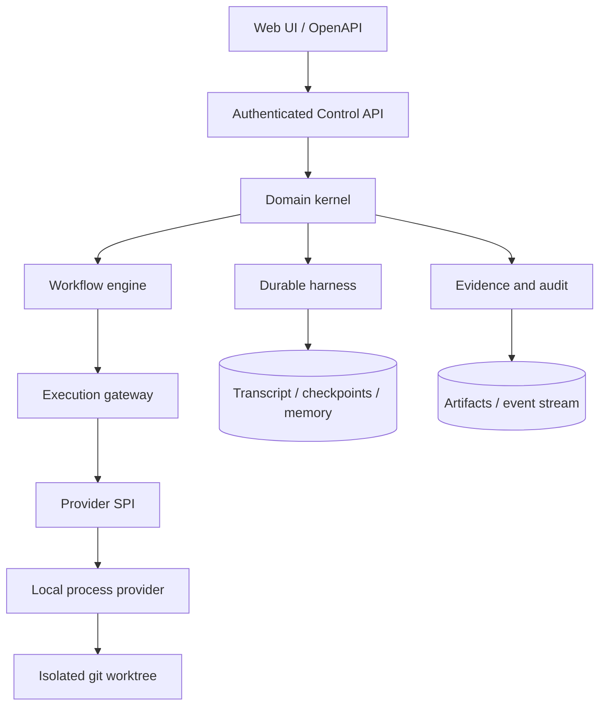
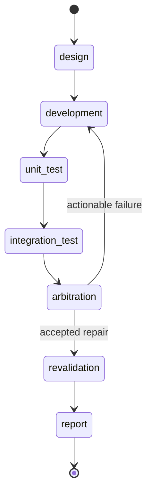

# ADRO Technical Design

This document is the English companion to the Chinese technical design. It
describes the contracts that make the local profile durable, auditable, and
extensible without coupling the kernel to a particular execution vendor.

## Design goals

- Keep requirements, work items, pipeline transitions, evidence, context, and
  audit facts in the ADRO control plane.
- Preserve one logical session across design, development, testing, repair, and
  reporting. A repair may create a new attempt, but it must reuse the original
  context and provider worktree when the provider supports continuation.
- Persist before side effects. Leases, idempotency records, checkpoints, and
  outbox events make retries and process restarts deterministic.
- Fail closed when evidence, signatures, permissions, capabilities, or session
  continuity cannot be verified.

## Runtime shape

The local profile stores state in atomic mode-0600 JSON snapshots and exposes
the same versioned interfaces used by future database, queue, runner, and
identity adapters. External adapters remain explicit deployment inputs and
must pass the matching conformance suite before activation.

## Harness contract

The harness is an append-only session ledger:

1. A turn records role, prompt, response, tool events, usage, and source
   citations before it is acknowledged.
2. Checkpoints include the session sequence, phase, provider binding, workspace
   fingerprint, and a hash of the previous checkpoint.
3. Compaction writes an exact archive window and a replacement summary; the
   archive remains addressable for replay and audit.
4. Memory items cite transcript or artifact IDs. Replacement and supersession
   are explicit, so stale facts are not silently merged into the active context.
5. Leases, outbox events, and recovery scans make an interrupted attempt
   observable and replayable. Duplicate claims are rejected atomically.
6. Bounded sessions enable an automatic budget guard. The guard archives the
   oldest contiguous transcript window, retains a configured tail, and keeps
   source/replacement hashes so the complete transcript remains auditable.

Requirement and bug comments are immutable, workspace-scoped records with
parent/root pointers. A mention or explicit dispatch request appends a follow-up
turn to the target session and dispatches the provider only after the durable
outbox intent and before-effect checkpoint exist. Replays restore a missing
after-effect checkpoint and use provider continuity only when the original
session and work directory are proven.

## Seven-stage workflow

An integration failure carries the failed evidence, context manifest, commit
baseline, and provider provenance back to the original development stage. The
state machine refuses an unproven continuation and records a durable reason
for suspension or manual escalation.

## Extension and operations

Provider, runner, Git, CI, deployment, artifact, notification, identity,
memory, compression, and scheduler integrations are versioned SPIs. Signed
plugin manifests declare capabilities and permissions; activation requires
digest and signature verification, health checks, and administrator approval.
The watchdog records `timed_out` or `suspended` instead of leaving an attempt
in an unbounded waiting state.

See `adro-technical-design.zh-CN.md` for the full field-level contract and
`../product-requirements.en.md` for the English product requirements.
