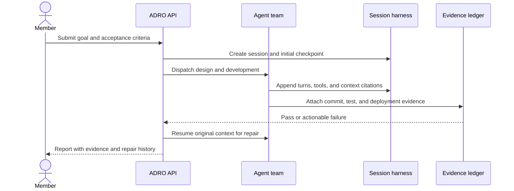

# ADRO Product Requirements

This document is the English companion to `product-requirements.zh-CN.md`.
ADRO is a standalone delivery control plane for individuals and enterprises.
People submit goals, configure policies, and review evidence; agents perform
the repeatable design, coding, testing, repair, and reporting work.

## P0 capabilities

- Tenant, member, project, repository, environment, agent, and secret-reference
  authorization with fail-closed ownership checks.
- Requirement, bug, and analysis work items with comments, attachments,
  dependencies, provenance, and immutable audit entries.
- Planner, Developer, Tester, Analyst, Repairer, and Arbiter roles routed through
  configurable agent bindings and capacity policies.
- Durable seven-stage orchestration with leases, idempotency, timeouts,
  retries, suspension, manual escalation, and process-restart recovery.
- Session, transcript, working memory, project memory, context manifests,
  exact compaction archives, and evidence citations that survive repair.
- Provider-neutral contracts for Git, CI, deployment, test, artifact,
  notification, identity, and observability integrations.
- An owned browser workbench, REST/OpenAPI transport, WebSocket event streams,
  cost/usage views, signed plugin lifecycle, and release checks on every push.

## User journey

## Acceptance and boundaries

An agent statement is never the only completion proof. A stage must provide the
required commit, test result, deployment health, artifact digest, or external
receipt before the gate advances. Missing credentials or external adapters are
reported as explicit prerequisites; the local profile does not pretend that a
production integration is connected.

The default release gate runs `go test`, race tests, vet, build, API/HTML/SBOM
contracts, startup checks, and five browser projects. `make real-e2e` adds a
real local coding client and records the complete requirement-to-report path.
