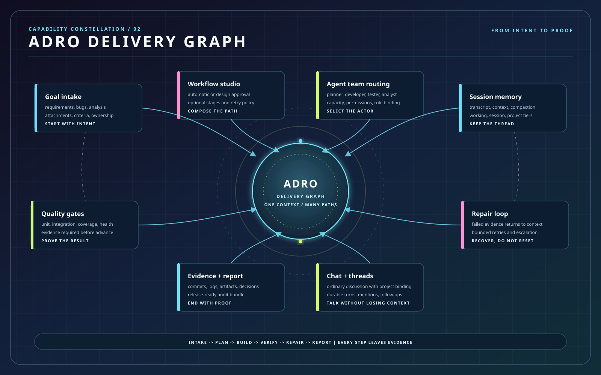

# ADRO 产品需求文档

版本：1.0（最终需求基线）<br>
状态：最终需求基线（待产品、研发、测试和安全签字确认）<br>
适用范围：ADRO 独立开源版、企业单租户部署、多租户 SaaS/私有化演进<br>
更新时间：2026-08-30

> 本文定义 ADRO 要解决的问题、必须交付的能力和明确不做的事情。ADRO 独立拥有业务事实、用户界面、状态模型和执行边界，生产环境不依赖任何外部编排产品。

## 1. 产品摘要

ADRO（Agentic Delivery & Release Orchestrator）是一个面向个人和企业的 AI 自动交付平台。用户提交需求、Bug 或分析任务，指定人员、项目和执行策略后，由 Agent 自动完成方案设计、研发、分析、测试、失败修复、复测、证据收集和报告输出。员工负责提交、配置、授权、验收和处理例外，不承担研发、测试或数分的实际执行；只有高风险或超过自动化策略边界的情况才进入人工处理队列。

ADRO 解决的不是“再做一个 Issue 看板”，而是把真实工作过程中的责任、上下文、执行、质量证据和异常恢复串成一个可追溯的闭环：



### 1.1 产品目标

1. 将“产品提需求、研发开发、测试提测、Bug 打回、二轮提测、验收报告”的人工串联流程变成可恢复的自动流水线。
2. 支持研发和非研发任务，特别是让 Analyst Agent 从现象、数据和问题描述生成可复现的结论报告。
3. 让企业可以创建自定义 Agent、管理多租户和成员、绑定多个项目，并按人员或项目自动路由任务。
4. 让同一个人、不同人和不同项目可以安全并行，不因一个任务阻塞整个团队。
5. 每一个“已完成”和“已通过”都能用 Commit、测试结果、部署版本、数据断言或外部系统回执证明，而不是只相信 Agent 的文字。
6. 最终生产部署完全不依赖外部编排产品；当前发行版只提供本地执行器，社区兼容插件必须独立安装并通过 SPI 验收。

### 1.2 产品成功标准

- 产品人员只提交一次需求或 Bug，就能看到系统自动推进到可验收结果，不需要手工创建一串子任务或反复催执行。
- 员工看到的是由 Developer/Tester Agent 生成的设计、代码基线、失败日志和影响范围，而不是一条孤立的 Bug 文本。
- 员工或测试负责人能复核环境、命令、日志、用例、覆盖率、失败堆栈和修复前后差异，并能一键打回原交付上下文。
- 管理者能按租户、项目、人员、Agent、模型和时间查看吞吐、成功率、失败原因、耗时和成本。
- 企业可以在无 Docker 的本地环境和标准企业基础设施中部署；生产凭证、密钥和租户数据不会泄露给 Agent 或其他租户。

## 2. 背景与问题定义

### 2.1 研发流程痛点

当前常见流程是：产品提交需求，研发设计方案并开发、自测，测试部署环境和整体测试，记录 Bug 并打回，研发修改后再次提测，最终由测试输出验收报告。这个流程的问题不是缺少某一个页面，而是：

- 需求、代码、测试和报告分散在多个系统，责任边界和当前进度不清楚。
- 创建了任务却不一定自动执行，审核节点、人工提醒和队列状态容易让流程停住。
- Bug 打回后经常丢失原设计、代码基线和失败日志，研发只能重新理解问题。
- 一个需求涉及多个仓库或项目时，需要人工拆分、分配和协调依赖。
- Agent 的“完成”与仓库真的有 Commit、CI 真的通过、PR 真的存在之间没有独立证据。
- 同一成员同时承担多个项目时，缺少公平的并发、容量和优先级调度。

### 2.2 非研发流程

数据分析场景可能需要针对指标异常、用户反馈或经营现象取数、验证假设、做对比分析并输出结论报告。这个过程同样需要输入、上下文、步骤、数据证据、复核和可追溯产物，不能被强行建模为“写代码 Issue”。

### 2.3 产品判断

ADRO 将需求、执行、证据和异常恢复建模为一个可审计的交付闭环。外部执行器、代码托管、CI、部署、通知、身份和存储都只能通过版本化 SPI 接入；核心状态机不会把任何供应商的对象或协议当作业务事实。

## 3. 产品边界

### 3.1 必须做（P0，推广前不可缺失）

- 多租户、成员、角色、项目、仓库和环境权限。
- 需求、Bug、分析任务三类 Work Item，以及相互关联、附件和评论。
- 自定义 Agent、Agent Team/Pool、执行器发现、角色路由和并发控制。
- 持久化流程编排、自动执行策略、阶段回退、重试、超时、暂停和重启恢复。
- 需求方案、代码开发、单测、集成测试、测试环境部署、Bug 修复、多轮复测和最终报告。
- Session/Context/Provenance 记忆，保证修复沿用原上下文和代码基线。
- Git/CI 证据的 provider-neutral 契约和本地证据链；GitHub、CI、Webhook 的生产连接器属于 P0 外部验收前置条件，必须通过插件安装和真实凭证契约测试后才能宣称已交付。
- 可审计 Artifact、EvidenceBundle、运行日志、测试报告和下载附件。
- 自有 Web 工作台，提供提交、监控、审核例外、复盘和报告查看。
- 钉钉、飞书通知与交互回执的 provider-neutral 事件模型和通知 SPI；具体连接器、回调验签、重放保护和成员映射属于 P0 外部验收前置条件，未安装时必须显示 `reference-only`/`blocked_external_prerequisite`。

### 3.2 应做但可分阶段交付（P1）

- GitLab、Gitea/Forgejo 等 Git Provider。
- 多种代码 Agent/CLI、远程 Runner、云 ArtifactStore 和 Kubernetes 部署。
- 面向知识库/Skill 的分析执行能力增强；原生数据连接器只在 Skill 无法封装时作为后续扩展。
- 项目模板、流程模板、定时任务、Webhook 触发、成本预算和容量预测。
- 钉钉/飞书内嵌工作台、移动端审批、邮件和更多企业通知渠道。
- 语义检索、组织知识库、跨项目影响图和自动去重。

### 3.3 明确不做

- 不复制或嵌入任何外部产品的 Web、桌面、移动 UI、聊天、看板和文案。
- 不把外部系统的任务树、数据库或未版本化 API 作为 ADRO 的核心数据模型；ADRO 使用阶段、Attempt、Transition、Dependency 和 Session。
- 不把外部客户端、模型或频道当作不可替换依赖；新增能力必须通过插件或 SPI。
- 不训练大模型、不替代 Git 托管、CI、测试环境或企业 IM；ADRO 编排并核验这些外部系统。
- 不允许无限自动修复、不把 Agent 自报结果当作唯一证据、不伪造 Git Author 或测试结论。
- 不承诺复制其他产品的页面、菜单或商业功能；目标是交付闭环和企业所需控制能力达到验收标准。

## 4. 用户、租户与权限

### 4.1 人和 Agent 的边界

ADRO 中“研发、测试、数分”首先是 **Agent 角色**，不是三个需要员工手动操作的业务菜单。真正执行命令、编写代码、部署环境、运行测试、查询知识库和生成报告的主体始终是 Agent。员工是业务责任人和治理者，主要负责输入目标、绑定项目、配置策略、处理例外和验收结果。

一个员工可以绑定多个项目；一个项目可以绑定多个员工和多个 Agent。创建任务时指定员工，实际含义是指定该员工名下的项目/权限/Agent 路由上下文，而不是把后续步骤变成该员工的手工待办。没有可用 Agent 或权限时，系统必须在排队前明确阻塞原因。

### 4.2 人类角色

| 角色 | 主要职责 | 默认权限边界 |
| --- | --- | --- |
| 租户管理员 | 组织、成员、项目、Agent、权限、密钥、配额和审计 | 租户内管理，不跨租户读写 |
| 产品/业务成员 | 提交需求、Bug 或分析目标，指定项目/成员和验收标准 | 只能操作授权项目；不直接执行研发/测试 |
| 交付负责人 | 配置流程模板、质量门禁、自动化策略和默认 Agent | 只能管理授权项目和模板 |
| 例外处理人 | 处理权限不足、冲突、超预算、风险动作和超过修复上限的 Run | 只能执行明确授权的人工决策 |
| 观察者/客户 | 查看授权项目状态、Evidence、报告和附件 | 只读，不可触发执行 |
| 平台运维 | Runner、Provider、通知、容量、备份和系统健康 | 不默认读取业务数据和密钥明文 |

员工不单独承担“研发人员、测试人员、数据分析师”的执行职责；这些职责由下表中的 Agent 角色完成。

### 4.3 Agent 角色

| Agent 角色 | 实际执行内容 | 可使用的典型能力 |
| --- | --- | --- |
| Planner | 澄清目标、拆解验收标准、生成方案和影响图 | 知识库 Skill、代码索引、项目规范 |
| Developer | 修改代码、补测试、提交分支和 PR | Git、Runner、代码 Skill、MCP |
| Tester | 部署测试环境、执行用例、收集失败证据 | TestRunner、CI、日志和浏览器 Skill |
| Analyst | 查询授权知识库、验证假设、生成结论 | 数据/文档 Skill、SQL/Notebook Skill、脱敏策略 |
| Repairer | 读取原 Session 和失败证据，做增量修复或重算 | ContextManifest、Git Diff、测试 Skill |
| Arbiter | 对失败分类、决定重试/回退/人工升级 | 状态机、策略、Evidence 规则 |

Agent 角色可以由同一个 AgentDefinition 承担，也可以分别绑定多个自定义 Agent；角色和执行器属于系统配置，不等于员工菜单。

### 4.4 组织层级

```text
Tenant
  -> Organization / Team
      -> Member
      -> Project (一个成员可加入多个项目)
          -> Repository / Environment / Data source
          -> Agent binding / Workflow policy
```

要求：

- `Tenant` 是所有业务数据的隔离边界，所有表和缓存键必须带 `tenant_id`。
- 一个成员可以加入 N 个项目，一个项目可以有 N 个成员；成员在项目中拥有独立角色和 Agent 路由配置。
- 一个需求可以指定 N 个成员、N 个项目和 N 个 Agent 候选；系统按策略求交集后生成稳定的 Assignment，并由 Agent 自动执行。
- 项目权限必须覆盖仓库、分支、环境、知识库/Skill、Secret 引用、Artifact 下载和通知渠道。
- 删除或禁用成员不能删除其历史执行记录；后续任务应转移给显式的替代 Owner 或进入例外队列。

### 4.5 身份和密钥

- 支持本地账号和 OIDC；企业版预留 SAML/LDAP/企业身份源适配。
- Token、PAT、Webhook secret、数据库密码和模型密钥只能存储在 SecretStore 引用中，页面、日志、事件和 Agent 上下文中禁止出现明文。
- 以最小权限创建 GitHub App/PAT；读取证据和提交代码使用可分离的凭证。
- 所有权限决策记录 `actor_id`、策略版本、资源、结果和时间。

## 5. 核心对象与数据模型

| 对象 | 关键字段 | 说明 |
| --- | --- | --- |
| Tenant | `id`, `name`, `plan`, `quota`, `status` | 租户和配额边界 |
| Member | `id`, `identity_id`, `roles`, `status` | 真实员工，不等同于 Agent |
| Project | `id`, `tenant_id`, `members`, `repositories`, `environments`, `agent_bindings` | 交付和权限最小单元 |
| Repository | `provider`, `owner`, `name`, `default_branch`, `credential_ref` | Git 仓库绑定 |
| KnowledgeBase | `id`, `tenant_id`, `scope`, `skill_bindings`, `retention` | 文档、规范、数据访问由 Skill 封装的知识上下文 |
| AgentDefinition | `role`, `executor`, `model`, `instructions`, `skills`, `mcp`, `limits` | 可复用的自定义 Agent |
| AgentTeam | `id`, `members`, `leader`, `routing_policy`, `capacity` | 多 Agent 协作池，替代照搬 Squad 的内部模型 |
| WorkflowTemplate | `stages`, `transitions`, `gates`, `retry_policy`, `approval_policy` | 可版本化的自动化流程 |
| ProviderBinding | `provider`, `native_refs`, `capabilities`, `version` | 外部执行/代码/CI/通知系统的隔离引用 |
| Runner | `id`, `labels`, `capacity`, `health`, `workspace_root` | 执行位置和容量 |
| WorkItem | `kind`, `title`, `description`, `priority`, `owner`, `project_ids` | 需求、Bug 或分析任务 |
| Assignment | `work_item_id`, `member_id`, `agent_id`, `role`, `binding` | 任务当时的责任和路由快照 |
| PipelineRun | `session_id`, `stage`, `attempt`, `status`, `policy_version` | 一次完整自动流程 |
| StageAttempt | `stage`, `attempt_no`, `executor`, `started_at`, `ended_at` | 阶段执行记录 |
| ContextManifest | `baseline`, `head`, `conversation_refs`, `error_refs`, `artifact_refs` | 可恢复上下文清单 |
| Evidence | `kind`, `source`, `digest`, `observed_at`, `conclusion` | 独立质量证据 |
| Artifact | `uri`, `sha256`, `media_type`, `retention`, `access_policy` | 方案、日志、报告、截图等 |
| Notification | `channel`, `event`, `delivery`, `dedupe_key` | 钉钉、飞书等通知记录 |
| AuditEvent | `actor`, `action`, `resource`, `before`, `after`, `digest` | 不可变审计链 |

知识库和数据访问不是独立的业务执行菜单。数据源、SQL、接口和文档系统由 Skill/MCP 以最小权限提供给 Analyst、Planner 或 Tester Agent；只有在未来需要原生连接器治理时才新增独立对象。外部系统 ID 只允许存在于 `provider_bindings` 或执行适配器内部，不得成为 ADRO 业务主键。

## 6. Work Item 需求

### 6.1 类型

1. **Requirement**：产品需求、技术需求或变更请求。
2. **Bug**：测试或线上发现的问题，必须能关联原 Requirement、PipelineRun、Commit、环境和失败 Evidence。
3. **Analysis**：数据或业务现象分析，产出可复现的结论报告，不强制生成代码。
4. **Maintenance（P1）**：依赖升级、重构、文档和例行任务，复用同一编排能力。

### 6.2 创建和编辑

创建页面和 API 必须支持：

- 标题、目标、背景、验收标准、优先级、截止时间、标签和附件。
- 指定多个项目、多个成员、Agent 角色（Planner/Developer/Tester/Analyst）和 Agent 候选；成员选择只决定责任和权限上下文，不把执行交给员工。
- 选择仓库、分支策略、测试环境、知识库/Skill 权限和通知渠道。
- 从模板创建（例如 API 变更、页面功能、数据异常、线上 Bug）。
- Bug 关联一个或多个原需求，也支持从某次测试失败一键生成 Bug。
- 支持评论、@成员/@Agent、状态变更、订阅和活动时间线；评论是上下文引用，不替代 ContextManifest。
- 版本化编辑，保留变更差异；运行开始后锁定影响执行的字段，修改必须产生新的 revision。

### 6.3 关系和去重

- Requirement 可以关联多个 Bug、多个 PipelineRun、多个项目和多个仓库。
- Bug 必须保存 `parent_work_item_id` 或明确的外部来源；孤立 Bug 进入人工确认队列。
- 根据标题、堆栈、测试用例、环境和代码位置计算 Bug fingerprint；重复 Bug 默认合并到已有活动项，不丢失来源。
- 支持阻塞、依赖、关联、回归和替代关系；依赖图存在环时拒绝自动执行。

## 7. Agent、执行器与扩展

### 7.1 自定义 Agent

管理员或项目授权成员可以创建和版本化 Agent，字段包括：

- 名称、角色、描述、系统指令、输出契约和失败处理策略。
- 执行器类型（Codex CLI、其他 CLI、HTTP/远程 Runner、分析执行器）。
- 模型、推理级别、最大 Token、超时、最大并发和单次成本上限。
- 可用 Skill、MCP 工具、环境变量 Secret 引用、网络出口和文件系统范围。
- 允许的租户/项目/仓库/分支/环境，以及是否允许写代码、提交、部署或发送通知。
- 版本、发布状态、创建人、审批记录和回滚版本。

Agent 不直接决定业务流程；它只能在 Workflow 为其分配的阶段和权限内执行。

### 7.2 角色与默认 Agent

首期内置可编辑模板：

- `Planner`：澄清需求、识别影响范围、生成 Design Doc 和验收映射。
- `Developer`：按方案修改代码、补测试、生成 Commit/PR。
- `Tester`：执行单测、集成测试、API/浏览器/数据校验并生成 Evidence。
- `Repairer`：读取原 Session 和失败证据，做最小增量修复。
- `Analyst`：执行取数、假设验证、敏感数据检查并生成结论报告。
- `Arbiter`：判断失败类型和下一跳，不得绕过证据门禁。

团队可以将多个角色绑定到不同 Agent，也可以用同一个 Agent 在不同阶段使用不同工具策略。员工只负责选择或配置这些 Agent，不作为阶段执行人出现在运行队列中。

### 7.3 SPI

业务层只依赖稳定接口，至少包括：

```text
ExecutionProvider
  discoverCapabilities()
  createRun()
  startStage()
  streamEvents(cursor)
  getRunSnapshot()
  cancelRun()

CodeExecutor     -> checkout / edit / test / commit / pull-request
TestRunner       -> unit / integration / browser / data checks
Deployer         -> test environment deploy / rollback / health
EvidenceProvider -> git / ci / deploy / log / data evidence
NotificationSink -> DingTalk / Feishu / email / webhook
```

生产环境必须使用真实 Provider。确定性 Provider 只能存在于自动化测试，不能作为产品运行模式。

### 7.4 知识库与 Skill

知识库是 Agent 的上下文能力，不是要求员工维护的独立数据工程产品：

- 文档、代码规范、项目约定、历史报告和可授权的数据访问均以 KnowledgeBase/Skill 形式挂载到 Agent。
- Skill 负责检索、查询、脱敏、结果摘要、工具调用和失败重试；原始数据不进入通用长期记忆或通知。
- 同一 Skill 可以被 Planner、Developer、Tester、Analyst 等多个 Agent 复用，但每次使用都记录版本、权限、输入摘要和结果摘要。
- P0 不要求实现一套新的数据仓库或全量连接器；只要求 Skill 能稳定提供任务需要的知识和数据证据。

### 7.5 Agent Team/Pool（Squad 等价能力）

为支持多 Agent 团队路由，ADRO 提供自己的 AgentTeam，而不是复制通用任务树：

- 一个 Team 包含多个角色 Agent、一个可选的 Leader/Router、候补 Agent、项目范围和并发容量。
- Router 根据任务类型、Skill、仓库、模型、成本、健康和负载选择实际执行 Agent；Leader 只负责路由和汇总，不替代阶段状态机。
- 支持固定 Agent、按角色自动发现、故障转移、冷却时间和人工指定覆盖；每次选择记录原因和策略版本。
- 一个 Team 可以服务多个项目，但所有成员、仓库、Skill 和 Secret 权限必须经过项目/租户校验。
- Agent Team 的协作产物回写同一个 Session；并行分支通过依赖和资源锁汇合，员工不需要手工维护子任务。

## 8. 自动编排与流程需求

### 8.1 默认阶段

| 阶段 | 输入 | 必须产出 | 成功后的下一步 |
| --- | --- | --- | --- |
| S1 方案 | WorkItem、项目、仓库和约束 | Design Doc、影响图、验收映射 | S2 |
| S2 开发/分析 | Design Doc、ContextManifest | Commit/分析中间产物、变更说明 | S3 或 S6 |
| S3 自测 | 当前 head、测试策略 | 单测、覆盖率、日志和结论 | S4；失败回 S2 |
| S4 提测 | Artifact、环境配置 | 部署版本、集成/浏览器/数据 Evidence | S5；失败回 S2 |
| S5 评审/打回 | 全部证据或人工 Bug | 通过、打回原因或暂停决定 | S7 或 S2 |
| S6 修复/复测 | 原 Session、失败 Evidence | 增量修复、二轮 S3/S4 证据 | S5 |
| S7 报告 | 完整 EvidenceBundle | 验收报告、PR、附件、通知 | 完成 |

Analysis 任务可使用 `S1 -> S2(分析) -> S3(数据质量/复核) -> S7` 的短流程；流程模板必须显式声明跳过的阶段和理由。

### 8.2 状态机

```text
draft -> queued -> running -> waiting_external -> succeeded
                         |             |
                         |             +-> blocked / cancelled
                         +-> retrying -> running
                         +-> needs_human -> running / cancelled
```

- 每一次状态变化写入事务和事件，带 `session_id`、`stage`、`attempt_no`、`actor`、`policy_version`。
- 阶段只能按模板允许的 transition 前进或回退；非法跳转返回冲突错误。
- Worker 领取使用 lease 和幂等键；进程崩溃后 lease 到期，任务从持久化状态恢复。
- 重试区分 Agent 失败、Provider 限流、测试失败、权限失败、证据缺失和策略拒绝，不能把所有失败都重跑。
- 达到阶段或全流程修复上限后进入 `needs_human`，并给出下一步操作，不静默失败。

### 8.3 自动执行策略

ADRO 的默认体验是“允许就自动执行”，不是“每个阶段都等待审核”。每个租户、项目和模板可配置；定时任务、外部 Webhook 和手动触发统一称为 **Autopilot**，但触发后仍进入同一 PipelineRun 状态机：

- 自动启动：创建后立即排队，或等待指定时间窗口。
- 自动审核：低风险项目允许方案、开发、自测、提测自动流转。
- 必须人工确认：生产部署、跨租户数据、删除操作、超过成本预算、风险等级高或证据不完整。
- 失败处理：自动修复、只重跑测试、暂停并通知、转派成员或取消。
- 并发：按租户、项目、成员、Agent、仓库和环境配置队列容量。

每次自动决策必须显示“命中的策略、允许的动作、阻止原因和下一步”，避免用户误以为系统卡住。

### 8.4 并行与协调

- 同一需求的互不依赖仓库可以并行开发和测试；共享文件、数据库迁移或同一环境的步骤必须声明资源锁。
- 同一成员可并行处理多个项目，但不能超过个人和 Agent 并发上限。
- 不同成员在同一项目并行时，用 branch/worktree、锁和冲突检测隔离；合并冲突进入协调阶段，不自动覆盖他人改动。
- 队列采用优先级、截止时间、老化和公平性结合的调度；紧急 Bug 可抢占等待中的低优先级任务，但保留审计记录。

## 9. 记忆、上下文与修复

### 9.1 Context Manifest

每次 Run 必须生成不可变的 ContextManifest，至少包括：

- 原始 WorkItem revision、Design Doc 版本、验收标准和项目策略版本。
- 仓库 URL、分支、baseline SHA、当前 head SHA、工作区和工具版本。
- Agent 输入摘要、结构化输出、关键决策和人工评论引用。
- 测试命令、失败堆栈、日志查询、部署版本、环境变量非敏感摘要和 Evidence 引用。
- 前一次 Attempt、修复原因、变更文件、补丁摘要和未解决风险。

完整提示词和大文件放 ArtifactStore；数据库只保存索引、摘要、摘要哈希和访问策略。

### 9.2 Bug 回流

1. 测试失败或人工创建 Bug 时，系统根据 Run、Commit、环境、测试用例和 fingerprint 绑定原 Requirement。
2. `Repairer` 必须读取原 ContextManifest 和错误证据，禁止从空白上下文开始。
3. 修复只能在新的 attempt/worktree 上进行；原代码和失败证据保持不可变。
4. 修复后强制重新执行受影响的单测和集成测试；不能只修改状态为“已修复”。
5. 多轮失败保留每轮差异和结论；超过上限后转人工，并向指定成员和测试频道通知。

### 9.3 ADRO 独有能力：上下文恢复评分

ADRO 应根据 ContextManifest 完整度、baseline/head 可验证性、失败证据关联度和 Agent 输出结构化程度计算 `context_recovery_score`。分数不足时，系统先补采集或请求澄清，不让 Agent 在缺少关键事实时盲修。

## 10. 代码、测试、部署和证据

### 10.1 代码交付

- 每次代码 Run 使用隔离 worktree 和短生命周期凭证。
- 代码修改、命令、终端输出、Diff、Commit、PR 和外部评论均写入审计或 Artifact 引用。
- Git Author 与真实操作者分离记录；不得伪装真人提交。
- Commit 前执行格式化、静态检查、秘密扫描和变更范围检查。
- PR 标题/body 自动包含 ADRO WorkItem 标识，合并状态只能从真实 Provider 查询。

### 10.2 测试和质量门禁

测试策略由项目模板声明，支持单测、集成、API、浏览器、性能、数据质量和安全扫描。质量门禁至少包含：

- 命令、版本、工作目录、退出码和完整日志。
- JUnit/coverage/SARIF 等标准结果及其 SHA-256。
- 测试环境、部署版本、数据库迁移版本和依赖版本。
- checks 结论来自 CI/Git Provider 的独立查询或验签 Webhook。
- 失败用例、错误指纹、受影响仓库和建议回退阶段。

任何必需证据缺失、来源不可信、关联不唯一或数据过期时，Run 必须 fail-closed，并明确显示“证据不足”，不能显示绿色完成。

### 10.3 EvidenceBundle

一个可验收 Run 的 EvidenceBundle 包含：

```text
WorkItem revision
Design Doc digest
baseline SHA -> head SHA
changed files / diff digest
unit and integration test conclusions
coverage and quality scan
deployment version and health checks
CI checks / PR URL / review conclusion
repair attempts and bug fingerprints
artifact index, timestamps, provider versions
```

Evidence 必须带来源、采集时间、关联 ID、摘要哈希和过期策略。Agent 文本、Task message 或本地目录扫描只能作为诊断辅助，不能作为唯一生产证据。

## 11. 非研发分析流程

Analysis 是一种由 `Analyst` Agent 执行的 Work Item，不是一个需要员工手工操作的独立产品线，也不要求 ADRO 自建数据源平台。员工只提交现象、目标、口径和验收要求；知识库 Skill/MCP 为 Analyst Agent 提供已授权的数据和文档能力。

Analysis WorkItem 支持以下输入和产出：

- 现象、问题、时间范围、指标定义、业务假设、可使用的 KnowledgeBase/Skill 和通知策略。
- Analyst Agent 自动生成分析方案、查询/Notebook 步骤、抽样策略、口径校验和反事实对比。
- Skill 执行查询和质量检查，保存查询文本哈希、数据快照时间、行数、脱敏摘要和图表 Artifact。
- 低风险分析按策略自动完成；高风险或口径不确定时只把“需要业务确认”放入例外队列。
- 报告包括结论、证据、限制、可复现步骤、建议动作和未验证假设，并进入统一报告中心。

Analyst Agent 不得将原始敏感数据写入通用记忆、Prompt、日志或通知；字段级授权、脱敏和留存策略由 Skill/MCP 和租户策略执行。P0 不新增“数据源”菜单，数据治理入口属于“Skill 与知识库”和“集成与通知”中的配置能力。

## 12. 企业通知与外部入口

### 12.1 钉钉与飞书

通知 SPI 必须支持：

- 需求创建、开始、阶段完成、失败、需要人工、修复成功、报告生成和超预算事件。
- 文本、Markdown、卡片消息，包含 WorkItem、项目、责任人、当前阶段、风险和深链接。
- 卡片操作：查看详情、批准/拒绝、重试、暂停、取消、转派和确认 Bug。
- Webhook/应用回调验签、重放保护、事件去重、超时重试和死信记录。
- 组织成员与 ADRO Member 的稳定映射，离职、禁用和权限变化及时生效。

钉钉和飞书实现必须复用同一事件模型；差异留在连接器，不污染工作流核心。

### 12.2 其他入口

OpenAPI、Webhook、CLI 和 Web UI 是基础入口。Slack、邮件、Telegram 等作为 P1/P2 连接器，不得成为核心流程的硬编码依赖。

## 13. Web 工作台与完整菜单

ADRO 使用自己的 UI，以“我需要处理什么”和“这次交付是否有证据”为主线。研发、测试和数分是 Agent 角色，不设置三个供员工手工执行的菜单；员工通过工作台提交目标、查看 Agent 运行、处理例外和验收结果。

### 13.1 菜单总表

首版 Web 工作台固定以下 18 个菜单。菜单权限可以按员工、角色和项目授权；管理员可见全部菜单，但菜单可见不代表拥有该菜单内所有资源的执行权限。

| 编号 | 菜单 | 主要内容 | 典型使用人 |
| --- | --- | --- | --- |
| 01 | 工作台 | 我的提交、运行中、需要处理、风险、最近报告和全局活动 | 所有人 |
| 02 | 需求 | Requirement/Analysis 创建、模板、状态、关联、评论、附件和交付图 | 产品/业务成员 |
| 03 | 缺陷 | Bug 创建、原需求关联、指纹去重、失败证据和修复状态 | 产品/业务成员、例外处理人 |
| 04 | 人工验收与例外 | 高风险批准、证据不足、冲突、超预算、超过修复上限和转派 | 例外处理人、负责人 |
| 05 | 方案评审 | Planner Agent 的 Design Doc、影响图、验收映射和策略结果 | 负责人、产品成员 |
| 06 | 执行运行 | 所有 PipelineRun、Session、Stage/Attempt、实时事件和取消/重试 | 负责人、运维 |
| 07 | 变更与 Diff | Worktree、变更文件、Commit、PR、评论和合并状态 | 研发负责人、观察者 |
| 08 | 测试与质量 | 单测、集成、浏览器、CI、覆盖率、部署、失败分类和质量门禁 | 测试负责人、负责人 |
| 09 | 项目与仓库 | 项目、成员绑定、仓库、分支策略、环境、资源和 Agent 路由 | 管理员、交付负责人 |
| 10 | Agent 中心 | 自定义 Agent、角色、版本、模型、执行权限、并发和健康 | 管理员、交付负责人 |
| 11 | MCP 工具 | 工具注册、授权范围、Schema、健康检查、调用记录和失败策略 | 管理员、Agent 负责人 |
| 12 | Skill 与知识库 | Skill/KnowledgeBase 版本、挂载、检索权限、脱敏和使用记录 | 管理员、Agent 负责人 |
| 13 | 自动化规则 | 流程模板、自动启动、阶段策略、定时/Webhook 触发和修复上限 | 交付负责人 |
| 14 | 集成与通知 | GitHub/其他 Git、CI、部署、钉钉、飞书、身份和 Webhook | 管理员、运维 |
| 15 | 产物与证据 | Design Doc、日志、报告、截图、EvidenceBundle、下载和留存 | 所有人（按权限） |
| 16 | Runner 工作节点 | Runner 注册、工作区、容量、租约、健康、隔离和下线 | 平台运维 |
| 17 | 用量与成本 | Token、模型、运行时长、队列、项目/成员/Agent 成本和预算 | 管理员、负责人 |
| 18 | 租户与成员 | 租户设置、成员、角色、项目权限、菜单权限、密钥引用和审计 | 租户管理员 |

### 13.2 菜单行为要求

- **需求**菜单同时承载 Requirement 和 Analysis；不单独建立“数分”菜单。创建需求时选择任务类型和流程模板，后续由对应 Agent 自动执行。
- **缺陷**菜单支持从原需求、Run、测试用例或外部通知创建 Bug；点击修复后由 Repairer Agent 自动回流，不要求员工手工创建子任务。
- **执行运行、变更与 Diff、测试与质量**是不同观察视图，不是员工需要依次点击才能驱动流程；流程引擎按策略自动跳转。
- **项目与仓库**负责项目/成员/仓库绑定；真实执行者由 **Agent 中心** 配置和路由，成员不是执行器。
- **Skill 与知识库**承载数据访问、规范、历史报告和领域知识；不新增独立“数据源”菜单。
- **人工验收与例外**默认只显示真正需要人决策的事项；普通低风险阶段不进入人工队列。
- **集成与通知**提供钉钉、飞书的连接、验签、事件映射和回执；消息卡片深链回到 ADRO 自有页面。

UI 必须在 ADRO 自有页面完成主要流程。实时页面支持 cursor 断线恢复；没有权限的对象不出现在列表、搜索和事件流中。桌面宽屏显示完整侧栏，移动端优先显示工作台、需求、缺陷、例外和运行详情；钉钉/飞书内嵌页面复用同一权限和 API（P1）。

## 14. API 与事件契约

所有 API 以 ADRO 自有 `/api/v1` 契约为准，Provider 差异在适配器内隔离。初始资源包括：

```text
/tenants /members /projects /repositories /environments /knowledge-bases
/agents /runners /work-items /bugs /analysis
/runs /runs/{id}/stages /runs/{id}/evidence /runs/{id}/artifacts
/runs/{id}/retry /runs/{id}/cancel /runs/{id}/resume
/notifications /webhooks /audit-events /diagnostics
```

要求：

- 创建和触发接口支持幂等键；更新使用乐观版本，冲突返回可读的 revision 差异。
- 错误响应包含稳定 code、用户可理解的原因、是否可重试和建议动作，不暴露内部 Token/堆栈/SQL。
- 事件包含 `event_id`、`tenant_id`、`resource_id`、`session_id`、`cursor`、`occurred_at` 和 schema version。
- WebSocket/SSE 只传输当前用户有权访问的事件；断线可从 cursor 补偿。
- OpenAPI、事件 JSON Schema 和 Provider SPI 必须版本化并有 contract test。

## 15. ADRO 独有的效率功能

以下能力是 ADRO 的差异化重点：

1. **策略驱动的无人值守**：项目级定义何时自动开始、何时自动修复、何时才需要人工，默认不因普通阶段反复等待审核。
2. **交付证据门禁**：把 Commit、CI、部署、测试、数据和 PR 证据统一成可核验 Bundle，防止“看起来完成”。
3. **一需求多项目交付图**：从需求自动建立跨仓影响图、并行分支和合并依赖，显示每个项目为什么需要修改。
4. **上下文恢复与最小修复**：自动保存基线、失败原因和每轮差异，修复只针对受影响范围，不让 Agent 从头猜测。
5. **例外优先工作台**：正常流程不打扰人，首页只聚合权限不足、证据缺失、冲突、超预算和需要决策的事项。
6. **公平并发调度**：在项目优先级、截止时间、成员负载、Agent 容量和仓库锁之间做可解释的调度。
7. **分析任务一等公民**：数据分析与代码交付共享审计、证据和报告能力，但拥有独立的数据权限和脱敏规则。
8. **结果可复盘**：自动生成“本次交付为何成功/失败”的时间线、决策路径、成本和可复现命令，而不是只有一条最终状态。
9. **模板化企业流程**：将 API 变更、线上 Bug、数据异常等流程封装为可版本化模板，项目可以继承后覆盖策略。
10. **可拔出 Provider**：业务事实属于 ADRO，Codex、GitHub、CI、钉钉、飞书和社区执行器都只通过可替换连接器接入。

## 16. 安全、可靠性与运维要求

### 16.1 安全

- 默认租户隔离；查询、缓存、Artifact、事件和搜索均执行租户及项目权限检查。
- Agent 在隔离 Runner/worktree 执行，命令采用 argv 结构，不拼接不可信 Shell 字符串。
- 网络出口、文件路径、可用工具、资源配额和运行时长按项目策略限制。
- Secret 只以引用注入，脱离进程后立即清理；日志和 Artifact 做敏感信息扫描。
- Webhook、Provider 和通知回调必须验签，支持轮换、重放保护和失效处理。
- 审计事件不可变，管理员操作、策略变更、权限变化、数据导出和手工覆盖均必须记录。

### 16.2 可靠性

- 所有长流程状态持久化，Worker 可横向扩展，重复投递不会重复提交代码或发送不可控副作用。
- 事件采用至少一次投递、幂等消费和 cursor 回放；外部系统短暂不可用时进入 `waiting_external`，而不是丢失任务。
- 单节点目标：RPO 不超过 5 分钟，RTO 不超过 30 分钟；企业 HA 目标在部署 profile 中单独声明。
- Artifact 使用内容寻址和校验，报告生成失败不能丢失原始 Evidence。
- 所有 Provider 能力先探测再调用；能力缺失时 fail-closed 并给出迁移或补偿建议。

### 16.3 可观测性

记录每个租户、项目、Run、Stage、Agent、Runner 和 Provider 的：吞吐、耗时、排队时间、成功率、失败分类、重试次数、Token/成本、资源使用和通知送达率。指标、日志、Trace 和审计事件不得包含秘密或未经授权的业务数据。

## 17. 版本规划与交付门槛

### 17.1 P0：可推广闭环

必须真实通过以下链路后，才可声称“可推广”：

- 多租户成员、项目和权限：不同成员只能看到授权项目。
- 自定义 Agent 和真实 Codex 执行：发现、路由、并发、超时和失败分类有效。
- Requirement：指定 N 个成员/N 个项目，跨仓库并行，生成真实 Commit、CI checks、PR 和报告。
- Bug：从原需求或测试失败创建，回到原 Session，修复后自动二轮/多轮复测。
- Analysis：由 Analyst Agent 通过知识库/Skill 从现象生成结论报告，包含查询/数据质量/脱敏证据。
- 钉钉和飞书：事件通知、卡片操作、验签、重试和权限映射。
- 重启、断网、Provider 限流、Runner 下线、证据缺失和权限拒绝等故障注入。
- API、Web UI、Webhook、Audit 和 Artifact 的权限/幂等/回放测试。

### 17.2 P1：规模化和生态

增加多 Runner/多执行器、GitLab 等 Provider、数据连接器、组织知识库、成本预算、模板市场、移动/内嵌入口和云存储。每项能力必须以 SPI/版本化契约加入，不改变核心 WorkItem/Run 语义。

### 17.3 Definition of Done

一个功能只有同时满足以下条件才算完成：

1. 需求、权限、API、UI、事件、审计和错误路径均有设计。
2. 有单元测试、API contract test 和端到端真实依赖测试；Mock 只用于单测隔离。
3. 可在无 Docker 的本地环境启动，企业部署方式有配置和回滚说明。
4. 日志、指标、Trace、Evidence 和报告足以复盘一次失败。
5. 文档说明数据留存、权限、密钥、升级和故障处理。
6. 通过安全评审、租户隔离测试和人工验收；不能只凭绿色单测宣布完成。

## 18. 关键验收场景

| 编号 | 场景 | 通过条件 |
| --- | --- | --- |
| A | 产品提交需求，指定 2 个项目和 3 名成员 | 自动生成路由快照，允许的仓库并行执行，完成后汇总一份报告 |
| B | 同一成员同时运行 3 个项目 | 任务不互相覆盖，队列遵循容量/优先级，所有事件可分别追溯 |
| C | 测试发现 Bug 并关联原需求 | Bug 带原 Run、Commit、环境和失败证据，Repairer 使用原 Session 修复 |
| D | 二轮测试再次失败 | 新 attempt 保留前轮差异，达到上限进入人工队列并通知责任人 |
| E | Agent 宣称成功但没有 Commit/CI 证据 | Run 保持证据不足，不得进入完成或报告通过 |
| F | API/Provider/Runner 中途断开 | 任务进入等待或重试，恢复后继续，不重复产生不可逆副作用 |
| G | 数据分析异常 | Analyst Agent 通过授权 KnowledgeBase/Skill 输出可复现查询、数据时间点、质量检查、脱敏摘要、结论和限制 |
| H | 钉钉/飞书卡片点击批准或重试 | 验签并校验权限，操作幂等，事件和审计完整 |
| I | 租户 A 访问租户 B 的 Run/Artifact | API、UI、搜索、事件和下载全部拒绝且记录审计 |
| J | 外部执行插件不可用或升级 | ADRO 明确显示执行器不可用；业务数据和流程不丢失 |

## 19. 开源与实现原则

- 采用 clean-room 实现：以本文、公开协议、标准 Git/HTTP/Webhook/CLI 行为和黑盒验收定义需求。
- 不复制任何外部项目的源文件、目录、变量命名、UI、图片、文案或私有表结构；保留必要的第三方许可证和归属说明。
- Provider 适配器和业务核心分离，生产版不需要安装任何外部编排产品；当前版本的本地执行器可独立替换。
- 所有外部协议或实现都必须在设计评审记录中说明采用、改变或拒绝的原因，禁止把外部对象直接提升为 ADRO 业务事实。
- 发布前执行依赖、许可证、SBOM、漏洞、Secret、租户隔离和备份恢复检查；法律问题由项目负责人和法律顾问确认。

## 20. 待评审决策

以下事项需要产品和企业部署方在进入大规模开发前确认：

1. 首个生产版本是单租户私有化还是直接支持多租户 SaaS；两者共享数据模型，但运维和隔离门槛不同。
2. 首期真实执行器是否只包含 Codex CLI，还是同时交付另一种 CLI/远程 Runner。
3. 钉钉、飞书采用企业自建应用还是群机器人；这决定成员映射、卡片操作和权限能力。
4. 测试环境由 ADRO 部署，还是只调用现有平台；需要明确 Deployer 的责任边界和回滚方式。
5. 企业的最低质量门禁、自动修复次数、成本预算、数据留存和人工升级 SLA。
6. 哪些高风险动作必须人工批准，哪些项目允许完全无人值守。

这些决策不会改变 ADRO 的核心原则：提交一次、自动推进、失败可恢复、证据可核验、权限可审计、Provider 可替换。

## 21. 最终自检与意图对照

本次需求澄清后，逐项对照用户目标进行检查：

| 用户意图 | 文档对应位置 | 自检结论 |
| --- | --- | --- |
| 研发、测试、数分真正由 Agent 执行 | 4.1、4.3、7.2、13.2 | 已明确；员工不作为执行人，也不设置三个手工执行菜单 |
| 员工可绑定多个项目 | 4.2、4.3、4.4 | 已覆盖；成员与项目多对多，成员选择生成路由上下文 |
| 需求指定多个成员和项目 | 6.2、8.4、18-A | 已覆盖；支持 N 个成员/N 个项目和跨仓并行 |
| Bug 关联原需求并自动修复 | 6.1、6.3、9.2、18-C/D | 已覆盖；保留原 Session、Commit、失败证据和多轮 Attempt |
| 提交后尽量不审核、不手动推进 | 8.3、13.2、15.1 | 已覆盖；默认按策略自动启动，只有高风险/异常进入人工队列 |
| 自定义 Agent 和自动发现客户端 | 7.1～7.3、10、17.1 | 已覆盖；Agent 可版本化，执行器通过 SPI/Provider 发现 |
| 项目、资源、任务、自动触发、运行、技能、附件和用量能力 | 5、6、7.5、8.3、10、12～14、17.1 | 已覆盖为 ADRO 自有对象、菜单和契约 |
| 记忆、编排、重试、恢复 | 8、9、16 | 已覆盖；状态机、ContextManifest、lease、幂等和故障恢复均为核心 |
| 钉钉、飞书能力 | 3.1、12、17-P0、18-H | 核心事件模型和 SPI 已覆盖；当前仓库未内置连接器，真实通知、卡片操作、验签、重试和成员映射仍需外部插件与凭证验收 |
| 数据分析流程 | 6.1、7.4、11、18-G | 已覆盖；由 Analyst Agent 执行，数据通过知识库/Skill，不把数据源做成核心菜单 |
| 自有 UI 和独立开源边界 | 3.3、13、19 | 已覆盖；核心页面和 Provider 均由 ADRO 自有契约承载 |
| 通过真实证据达到推广地步 | 10、17、18、19 | 发布门槛已定义；本地闭环证据已通过，Git/CI/部署/钉钉/飞书等外部适配器未随本仓库交付，不能把 SPI 或 deterministic fixture 写成生产 PASS |

### 21.1 未列为核心的内容

核心自动研发/测试/修复闭环没有发现新的代码缺项；但外部系统连接器是推广前的明确验收前置条件，不应误写为当前版本已完成。以下内容有意不放入本地单节点 profile：

- 外部产品原生页面、任务树内部语义、daemon 和数据库兼容层；
- 全部客户端/模型、全部 IM 渠道、计费和插件市场；
- 自建数据仓库和大量原生数据连接器；这些由 KnowledgeBase/Skill 解决，必要时再扩展；
- 员工逐阶段手工“领取研发/测试任务”；执行权属于 Agent，员工只处理策略允许的例外。
- GitHub/CI、钉钉/飞书、OIDC、PostgreSQL/NATS/Temporal、隔离 Runner 等生产适配器；它们由 SPI 和契约定义，需在目标企业环境安装、配置并完成真实验收。

### 21.2 最终产品定义

ADRO 是一个以 Agent 为执行主体、以员工为治理主体、以项目和租户为边界、以 Session 和证据为事实的自动交付系统：提交需求或 Bug 后，系统自动完成后续研发/分析和测试流程，只有无法安全自动处理的事项才打扰员工。

本节通过评审后，本文 `v1.0` 作为最终需求基线；后续代码实现和测试不得擅自缩减 P0，新增能力必须经过版本化需求变更。

## 22. 配套资料

- `docs/architecture/ga-readiness.md`：实现、参考实现和阻塞项的发布门禁。
- `docs/architecture/production-deployment.md`：单节点配置、生产适配器边界和恢复门禁。
